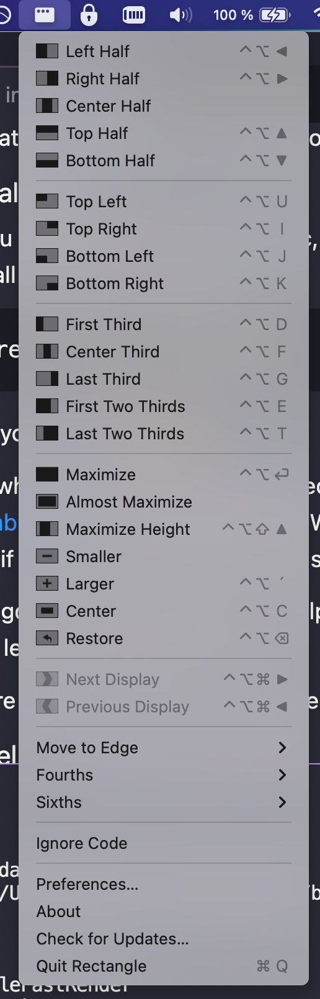

## Rectangle - Control your windows on MacOS with the ⌨️

I really like using MacOS, but something that always bothered me was the organization of my windows.  
Sure, you have e.g. virtual desktops or the menu when you push longer on the green button in the corner of the window. But this didn't satisfy me. Sometimes you want/need to organize windows horizontally or more than two windows on a desktop. Here, we reached the limitations of MacOS... and here comes in Rectangle!

### Installation
If you are using `brew` on your mac, it is super easy to install rectangle. Just type 
```bash
brew install rectangle
```
and you are done 😁👍

### Usage
The usage is as simple as it can be. You get an additional menu bar icon and the rest is self explaining. You activate the window you want to replace and push the key combination / click the format you want the window to be, e.g. `^ + option + U` to position the window in the upper left quarter of the screen.


This easy plugin really helps me to organize my windows and I hope it will so also for you 😁
