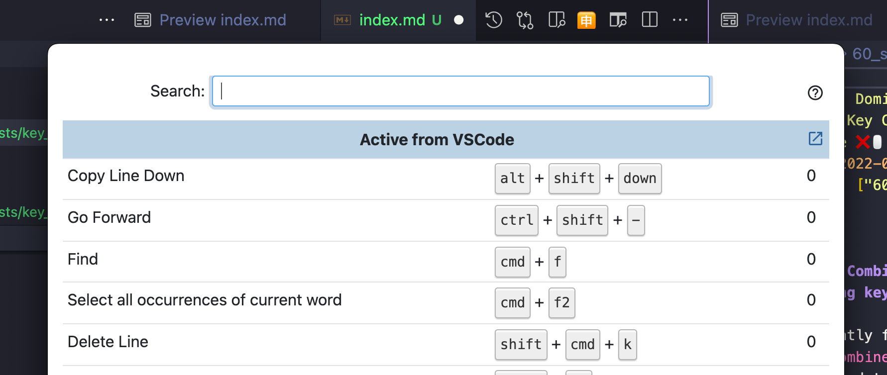

## Key Combiner - your one stop shop for learning keyboard shortcuts

I recently found
[Key Combiner](https://keycombiner.com/) and I just need to say: "Wow, what a great tool if you want to learn keyboard shortcuts!"

The goal of Key Combiner is to help you to find and also learn keyboard shortcuts.

There are two "levels" you can use Key Combiner.

### Level 1: Using the homepage
The homepage is great source of information. Just go to the [public collections](https://keycombiner.com/collections/) and search for the application that you want to learn more about. The collection is very rich, reaching from IDEs over browsers until online services like Gmail or Trello.

### Level 2: Using the Key Combiner tool for your OS
Key Combiner becomes even more powerful when you are using the Key Combiner tool you can [download](https://keycombiner.com/desktop/) for your respective OS.  
With this tool installed, you can access Key Combiner information with ease and it detects automatically your context. What do I mean by context? Let's assume I'm working in VS Code and press `Option + Command + C`. This opens the Key Combiner tool and shows me the keyboard shortcuts for my current context, here VS Code. 

As you can see, a nice overlay opens up and you can search for the shortcut you need. Pretty handy, right? 😁