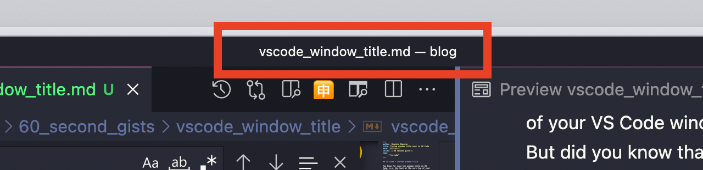
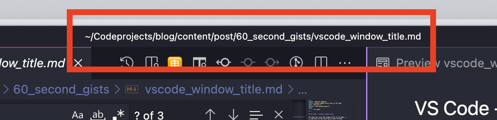
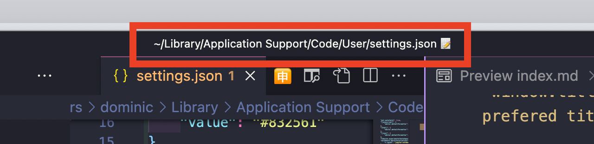

## VS Code - Custom window title

You know for sure the window title in VS Code, i.e. the text at the very top of your VS Code window.  
But did you know that (like most in VS Code) you can modify it such that it suits your working style best?

Just go to the .json settings (MacOS Shortcut: `Cmd + ;`) and add the key-value-pair `"window.title": "<your prefered title>"`


This is the default setting...
```json
"window.title" : "${activeEditorShort}${separator}${rootName}"
```
... and how the default setting looks like:


This is my setting... 
```json
"window.title" : "${activeEditorLong}"
```
... and how my setting looks like:


With this setting, I see the whole absolute filepath. This helps me to distinguish more easily in which project I am in comparison to the default value.  

For a complete list of variables you can use in the setting, please see [here](https://code.visualstudio.com/updates/v1_10#_configurable-window-title).

{}
If you like emojis as much as I do: you can also add emojis to the window title 🤯

{}


